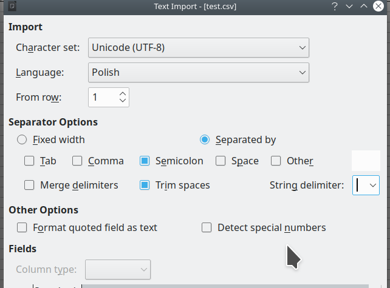
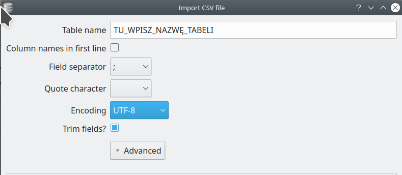

# Projekt zawierający tabelę zdrowego odżywiania

## Tabela kaloryczności produktów w (100g)

* zawiera kolumny i rekordy

### Kolumny:  
**Nazwa produktu**  
**Rodzaj**  : owoc, warzywo, zboża, nabiał, wędliny, konserwy, mięso, ryby, przyprawy, nasiona, inne.   
**kcal**  
**białka**  
**tłuszcze**  
**węglowodany**  

### Przykłady produktów   

* agrest
* banan
* cytryna
* dynia
* estragon
* figi suszone
* grejpfrut

# Linki do tabel w Internecie
[Tabela kaloryczności](https://potrafiszschudnac.pl/diety/tabele-kalorycznosci-produktow/)

[Kalkulator kalorii](https://kalkulatorkalorii.net/tabela-kalorii)
 

# Import danych z CSV

Co to jest CSV:  
* 1 plik CSV = tabela
* to nie jest format Excela
* csv jest formatem dla programistów

**Każdy plik csv ma parametry:**  

1. kodowanie znaków: przeważnie to będzie UTF-8  
2. czy ma byc nagłowek? True/False  
3. Separator (delimiter): przeważnie używany jest  , 
albo  ;  
4. Trim spaces? True/False
5. Quote character: przeważnie uzywany jest " albo '
ale do wielu tabel nie trzeba tego używać
6. Opcjonalnie: język (np. polish)  
7. Oznaczenie nowej linii: są dwa formaty - format 1 unix, format 2 windows

## ustawienia Librecalc

Najpierw musimy stworzyć nowy plik typu .csv  
w dolphinie idziemy do miejsca w którym chcemy stworzyć plik a następnie dajemy PPM > Create new > text file... 
plik podpisujemy:  
**nazwa\_Tabeli.csv**  
np.  
**SQL4\_food.csv**  

Następnie otwieramy libre calc i otwieramy plik:  
File > Open > wybieramy stworzony plik .csv    

Do otwarcia pliku używamy następujących parametrów:  



## ustawienia SQL

Najpierw otwieramy plik z bazą danych (plik z końcówką   .db)  

a następnie wybieramy:  
File > import > table from csv file...  

a następnie wybieramy plik typu .csv który chcemy zaimportować (wczytać do bazy)  

Do zaimportowania bazy danych używamy następujących parametrów:  



# Zapytania SQL

* SELECT pokazujący wszystkie produkty należące do rodzaju "owoc" :  

``` sql
 SELECT nazwa_produktu FROM SQL_4_food WHERE rodzaj='owoc';
 ```
* SELECT pokazujący wszystkie produkty należące do rodzaju "warzywo":

``` sql
SELECT nazwa_produktu FROM SQL_4_food WHERE rodzaj ="warzywo";
```

* SELECT pokazujący typ np. warzywo i wszystkie produkty warzywne mające mniej niż 70 kalorii:

``` sql
SELECT nazwa_produktu FROM SQL_4_food WHERE rodzaj="warzywo"AND kcal<=70;

* SELECT wyświetlający nazwy produktu, rodzaj, białka i tłuszcze

 ``` sql
  SELECT nazwa_produktu FROM SQL_4_food WHERE rodzaj="nasiona"AND białka<=5 AND tłuszcze<=1.2;
 ```


* Wszystkie produkty mające np. więcej niż 10 białka

``` sql
SELECT nazwa_produktu FROM SQL_4_food WHERE białka >=10;
```

``` sql
SELECT 
kcal+2 AS Gladiator, 
białka-1 AS Maximus, 
tłuszcze*(12 + węglowodany/4) AS AGATA 
FROM SQL_4_food;
```

``` sql
SELECT nazwa_produktu, rodzaj, (kcal*białka)+(węglowodany-tłuszcze) FROM SQL_4_food;

``` sql

```

* SELECT liczący ilość kcal dla posiłku składającego się z nast składników:
100g Ziemniaki gotowane  = 87 kcal  
100g Schab pieczony = 291 kcal  
100g Kapusta czerwona = 27 kcal  


* wszystkie produkty poniżej 200 kcal

``` sql
SELECT nazwa_produktu, kcal FROM SQL_4_food WHERE kcal <=200;
```

``` sql
SELECT nazwa_produktu FROM SQL_4_food WHERE kcal = "owoc" <=200;
```
* wszystkie produkty poniżej 100

``` sql
SELECT nazwa_produktu FROM SQL_4_food WHERE rodzaj = "warzywo" AND kcal <=100;
```

``` sql
SELECT nazwa_produktu FROM SQL_4_food WHERE rodzaj="owoc" AND kcal <= 50;
```

* wszystkie produkty poniżej 10 białka

``` sql
SELECT nazwa_produktu FROM SQL_4_food WHERE "białka" <= 10;
```

* wyświetlenie rekordu 0 i usunięcie tego jednego rekordu:

``` sql
SELECT nazwa_produktu FROM SQL_4_food WHERE nazwa_produktu = "0";
```

``` sql
DELETE FROM SQL_4_food WHERE nazwa_produktu="0";
```

* wszystkie produkty poniżej 5 tłuszczu

* wszystkie produkty poniżej 20 węglowodanów

* Przykłady innych zapytań

``` sql
DELETE FROM SQL_4_food WHERE nazwa_produktu="roa";
```

``` sql
INSERT INTO SQL_4_food (nazwa_produktu, rodzaj,kcal, białka, tłuszcze, węglowodany)
VALUES ('guma_orbit', 'inne', '50', '3', '2', '10');
```


``` sql
SELECT rodzaj, kcal, białka, tłuszcze, węglowodany
FROM SQL_4_food
WHERE rodzaj IS NULL AND węglowodany IS NULL;
``` 


``` sql
SELECT * FROM SQL_4_food WHERE (rodzaj IS NULL AND węglowodany IS NULL) OR (nazwa_produktu ='0' AND rodzaj='0' AND kcal ='0' AND białka ='0' AND tłuszcze ='0' AND węglowodany ='0');
```

``` sql
DELETE FROM SQL_4_food WHERE (rodzaj IS NULL AND węglowodany IS NULL) OR (nazwa_produktu ='0' AND rodzaj='0' AND kcal ='0' AND białka ='0' AND tłuszcze ='0' AND węglowodany ='0')
``` 
